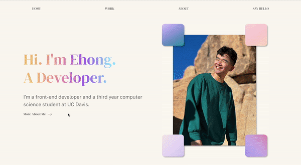

# Personal Website (version 2.0)

## Contents
* [General](#general)
* [Features](#features)

## General
My current website! This is my ongoing Web Development Project using **React.js**, **Node.js** and **Figma** for design.  
Check out this quick demo to see how my website looks/works! If interested in checking out my project, its url is **ehongkuo.com**

## Features

### Hover Animations

An ongoing design choice I made was to have a consistent hover animation throughout the page. This was achieved with the CSS rule: ::hover. As seen with the demo below, components are scaled up in size and the arrows horizontally.

### In-site Messaging

If a user would like to send me a quick message or question, they can do so without opening a new page with my contact form! Here is how it works:

